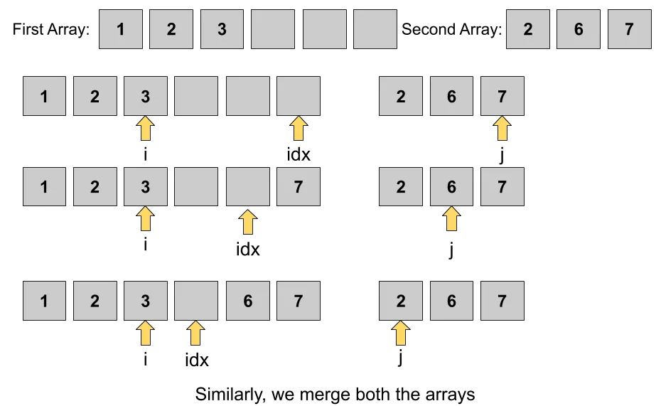

# Merge Sorted Array Problem
 Given two sorted arrays arr1[] and arr2[] of sizes m and n respectively. Write a program to merge them in such a way that the resultant array arr1 is sorted too.

  [LC-88](https://leetcode.com/problems/merge-sorted-array/)

## Example

Input: arr1 = [1,2,3,0,0,0], m = 3, arr2 = [2,5,6], n = 3

Output: [1,2,2,3,5,6]

## Approach 
- **Two Pointer Approach**

- Create two pointers
   1) p1: Pointing to arr1
   2) p2: Pointing to arr2
- create variable i = length of arr1
- Iterate untill p2 become less than 0 because arr1 length is always bigger then arr2
   - Then compare value of p1 and p2 of arrays whichever is larger get placed in ith position.
   - i will be decremented by 1 and also whichever pointer is greater also decremened by one.

## Complexity

- **Time:** `O(n)`:  There is only one loop which would run as many times as the number of elements in the larger array. So here we consider the size of the larger array. Hence Time Complexity is 0(n) where 'n' is the size of the larger array.
- **Space:** `O(1)`

## References

- [YouTube](https://www.youtube.com/watch?v=C4oBXLr3zos)