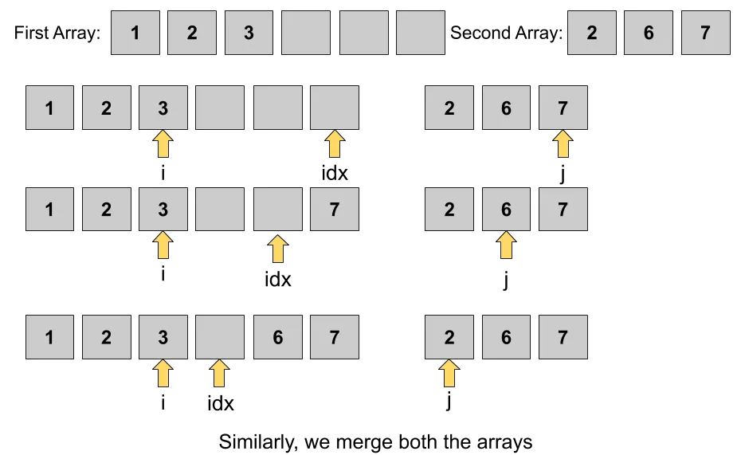

# Merge Sorted Array Problem
 Given two sorted arrays arr1[] and arr2[] of sizes m and n respectively. Write a program to merge them in such a way that the resultant array arr1 is sorted too.

  [LC-88](https://leetcode.com/problems/merge-sorted-array/)

## Example

Input: arr1 = [1,2,3,0,0,0], m = 3, arr2 = [2,5,6], n = 3

Output: [1,2,2,3,5,6]

## Approach

- We will create 3 pointers:
   1) p1: Pointing to arr1
   2) p2: Pointing to arr2
   3) k: to latest position of arr1(lenght of arr1)
- Iterate untill p2 become less than 0 because arr1 length is always bigger then arr2
   - Then compare value of p1 and p2 of arrays whichever is larger get placed in kth    position.
   - k will be decremented by 1 and also whichver pointer is greater also decremened by one.

## Complexity

- **Time:** `O(m+n)`: We have two different input as arr1 and arr2
- **Space:** `O(1)`

## References

- [YouTube](https://www.youtube.com/watch?v=C4oBXLr3zos)