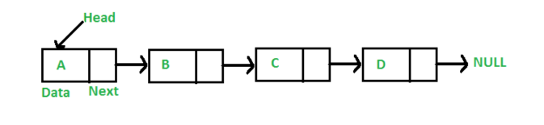

# Linked List
- A linked list is a data structure where every element is connected to the next one.
- A linked list is an ordered, linear data structure that's similar to an array. However, unlike in an array, elements aren't stored at a particular index; instead, they are connected through a chain of references. 
- In a linked list, each item contains a reference to the next item. Each element (or node) is stored as a separate object that contains two properties: the **data** stored and a **pointer** to the next node.
- An item in a linked list is called a node. The first node is called the head. The last node is called the tail, and tail points to null meaning end of list.
- **Singly Linked List** 

### **Linked List Time Complexities**
    Prepend: O(1)

    Append: O(1)

    Search: O(n)

    Insert: O(n)

    Delete: O(n)

### **When to use?**
- fast insertion and deletion

### **Pros**
- Simple implementation compare to Doubly Linked List
- less memory usage
- ordered

### **Cons**
- not able to iterate backwords
- slow lookup

## **Doubly Linked List** 

- In Doubly linked list, each node points to the next and the previous element.
- It enables traversing backwards.

### **Pros**
- able to iterate front to back

### **Cons**
- fairly complex to implement
